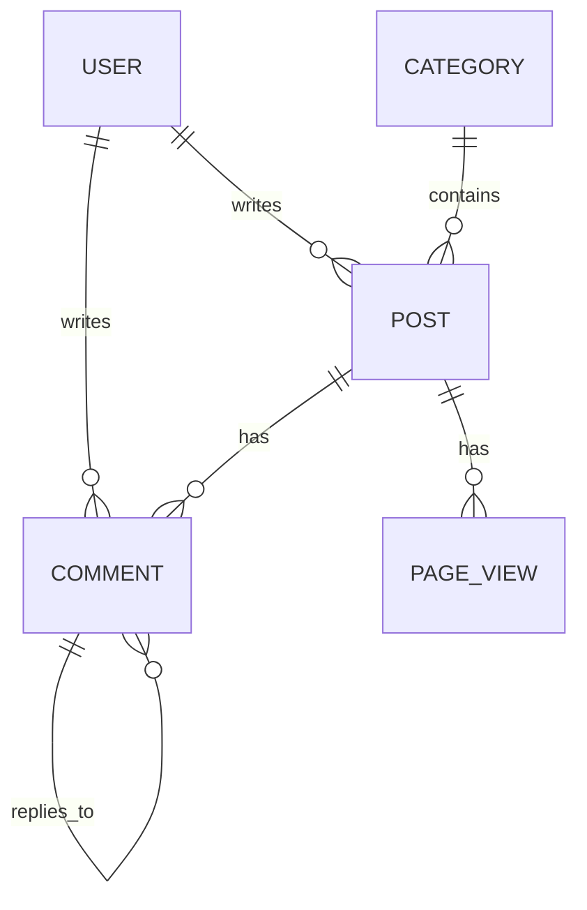

# 블로그 프로젝트

Flask 기반의 블로그 웹 애플리케이션입니다. 이 프로젝트는 개인 블로그 운영을 위한 기능들을 제공합니다.

## 🚀 기능

### 게시물 관리
- 게시물 CRUD 기능
- 카테고리별 게시물 분류
- 게시물 검색 기능
- 태그 시스템
- 조회수 추적
- 썸네일 및 대체 텍스트 지원

### 댓글 시스템
- 익명 댓글 작성
- 대댓글 기능
- IP 주소 기반 댓글 관리

### 사용자 인증
- 관리자 로그인
- 패스워드 해싱
- 세션 관리

### 사이트 설정
- 사이트 제목, 설명, 키워드 설정
- 소셜 미디어 링크 관리
- 구글 애널리틱스 연동

## 🛠 기술 스택

### 백엔드
- Python 3.8+
- Flask 2.0+
- SQLAlchemy
- PostgreSQL / SQLite
- Gunicorn (프로덕션 서버)

### 프론트엔드
- HTML5 / CSS3
- JavaScript (Vanilla)
- Bootstrap 5
- TinyMCE 에디터

### 데이터베이스
- PostgreSQL (프로덕션)
- SQLite (개발)
- Flask-Migrate (데이터베이스 마이그레이션)

### 배포
- Docker
- Docker Compose
- Nginx (리버스 프록시)

## 🚀 시작하기

### 사전 요구사항
- Python 3.8 이상
- PostgreSQL (또는 SQLite)
- Docker 및 Docker Compose (선택사항)

### 설치

1. 저장소 클론
   ```bash
   git clone https://github.com/devzerops/blog.git
   cd blog
   ```

2. 가상환경 설정 및 활성화
   ```bash
   python -m venv venv
   source venv/bin/activate  # Linux/Mac
   # 또는
   .\venv\Scripts\activate  # Windows
   ```

3. 의존성 설치
   ```bash
   pip install -r requirements.txt
   ```

4. 환경 변수 설정
   ```bash
   cp .env.example .env
   # .env 파일을 열어 필요한 설정 수정
   ```

5. 데이터베이스 초기화
   ```bash
   flask db upgrade
   flask init-db
   ```

### Docker를 사용한 실행

```bash
docker-compose up --build
```

### 개발 서버 실행

```bash
flask run
```

## 🗄 데이터베이스

### 모델 다이어그램



## 📝 API 문서

### 인증

#### 관리자 로그인
- **POST** `/admin/login`
- 요청 본문: `{ "username": "admin", "password": "password" }`
- 성공 시 JWT 토큰 반환

### 게시물

#### 게시물 목록 조회
- **GET** `/api/posts`
- 쿼리 파라미터: 
  - `page`: 페이지 번호
  - `per_page`: 페이지당 항목 수
  - `category`: 카테고리 필터
  - `q`: 검색어

#### 게시물 상세 조회
- **GET** `/api/posts/<int:post_id>`

## 🧪 테스트

```bash
pytest
```

## 📄 라이센스

이 프로젝트는 MIT 라이센스 하에 배포됩니다. 자세한 내용은 `LICENSE` 파일을 참조하세요.

## 👥 기여

1. Fork the Project
2. Create your Feature Branch (`git checkout -b feature/AmazingFeature`)
3. Commit your Changes (`git commit -m 'Add some AmazingFeature'`)
4. Push to the Branch (`git push origin feature/AmazingFeature`)
5. Open a Pull Request

## 📞 연락처

프로젝트 팀 - [@devzerops](https://github.com/devzerops)

## 🙏 감사의 말

- [Flask](https://flask.palletsprojects.com/)
- [Bootstrap](https://getbootstrap.com/)
- [TinyMCE](https://www.tiny.cloud/)
