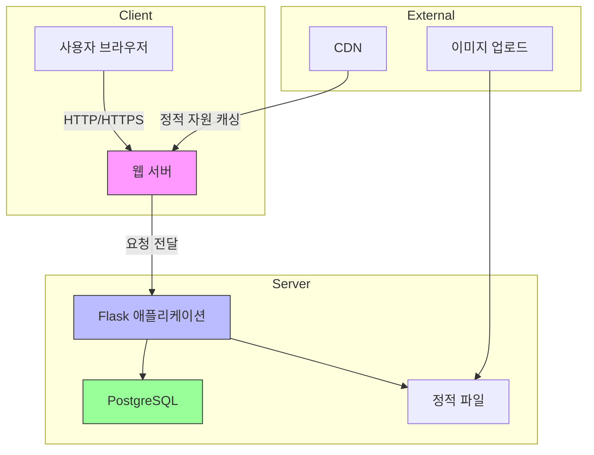
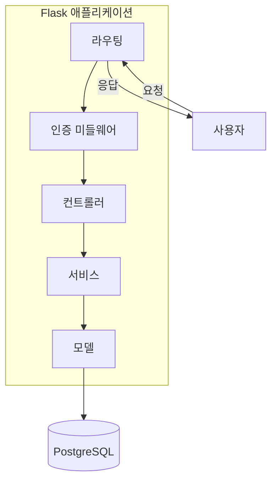
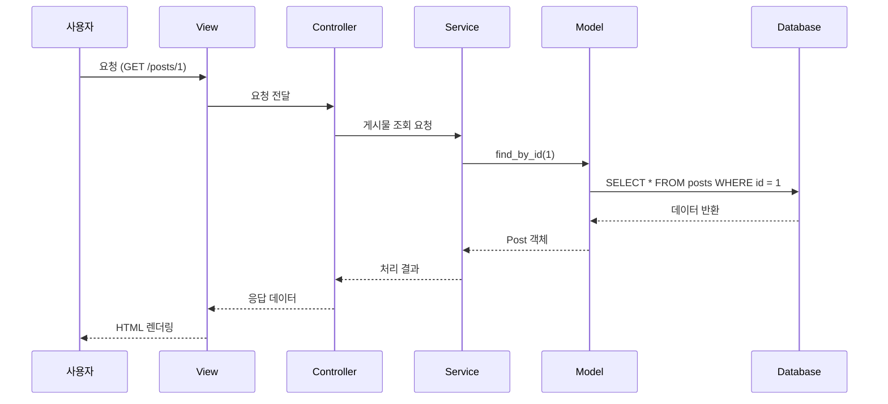
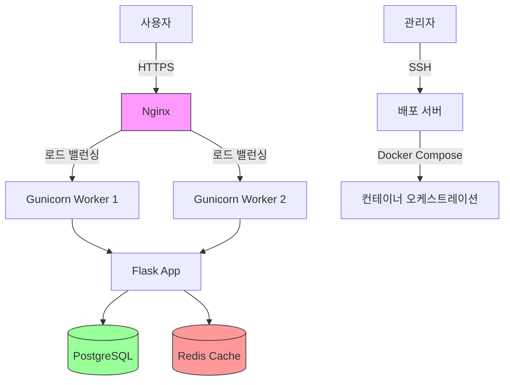
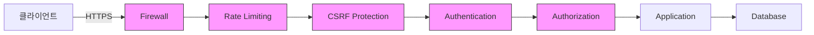
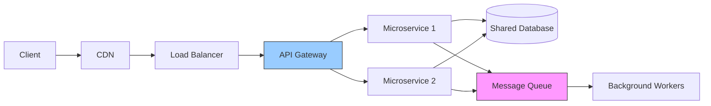

# 시스템 아키텍처

## 1. 전체 아키텍처 다이어그램

## 2. 컴포넌트 다이어그램

## 3. 데이터 흐름도

## 4. 배포 아키텍처

## 5. 보안 아키텍처

## 6. 확장 아키텍처 (향후 계획)

## 사용 방법

1. 각 다이어그램은 Mermaid 문법으로 작성되었습니다.
2. GitHub, GitLab, VS Code의 Mermaid 확장 프로그램 등에서 렌더링할 수 있습니다.
3. 필요에 따라 다이어그램을 수정하거나 확장할 수 있습니다.

## 참고 사항
- 실제 구현 환경에 따라 다이어그램을 조정해야 할 수 있습니다.
- 보안 설정은 프로덕션 환경에 맞게 추가로 구성해야 합니다.
